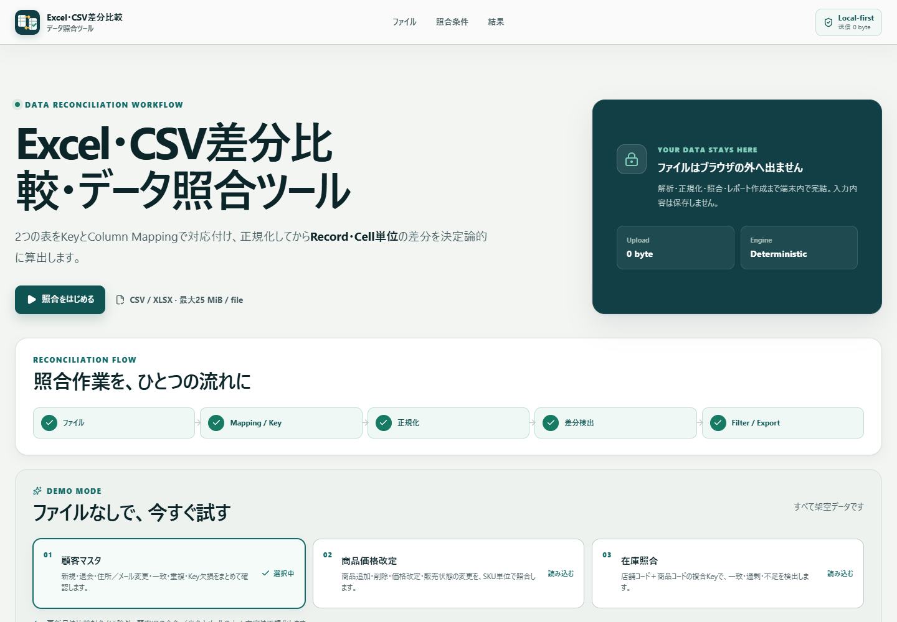
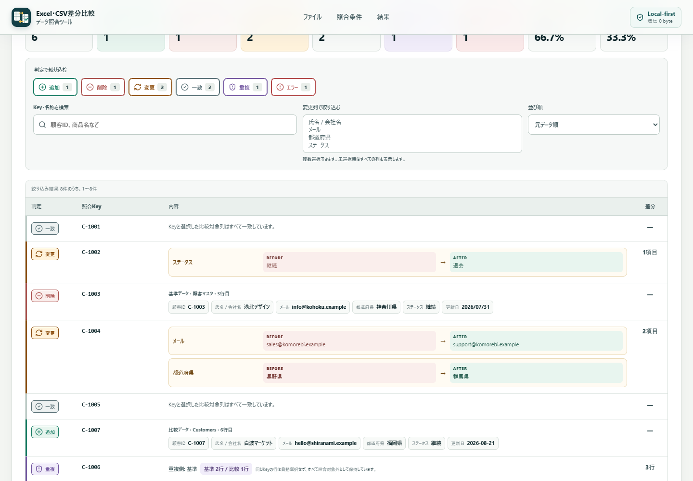
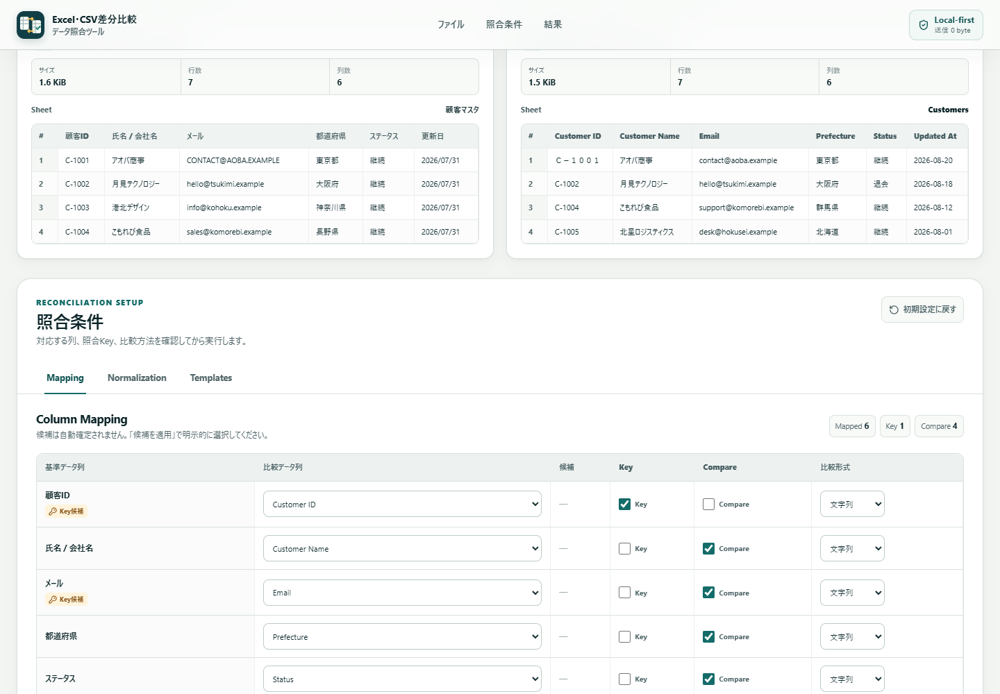
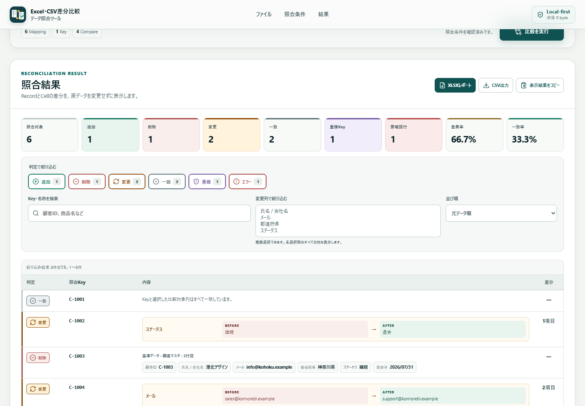
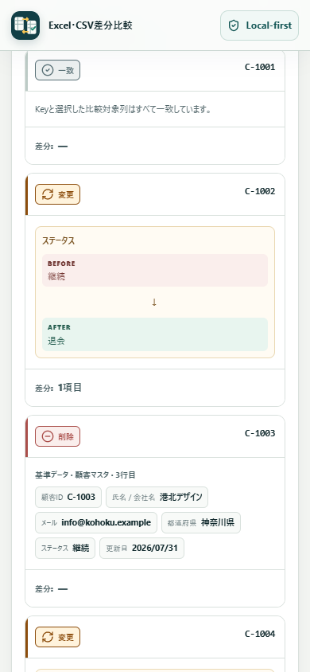

# Excel・CSV差分比較・データ照合ツール

2つのExcel / CSVを照合KeyとColumn Mappingで対応付け、正規化したうえでRecord・Cell単位の差分を決定論的に算出する、Local-firstの業務効率化Webアプリです。

- 本番アプリ: [https://excel-csv-diff-reconciliation-tool.vercel.app](https://excel-csv-diff-reconciliation-tool.vercel.app)
- ソースコード: [https://github.com/shunsoco-stack/excel-csv-diff-reconciliation-tool](https://github.com/shunsoco-stack/excel-csv-diff-reconciliation-tool)
- QA記録: [docs/QA.md](docs/QA.md)
- ポートフォリオ掲載文: [docs/portfolio-listing.md](docs/portfolio-listing.md)

> Vercel Productionとpublic GitHub repositoryを公開済みです。

## Overview

単純な行番号ベースのDiff Viewerではありません。異なる列名をMappingし、1列または複数列のKeyで同一Recordを特定して、追加・削除・変更・一致・重複・照合不能を一つのData Reconciliation Workflowで確認できます。

解析、正規化、照合、絞り込み、レポート作成はブラウザ内で実行します。入力ファイル本体や行データをアプリのServerへ送信・永続保存する処理はありません。

## Problem

月次マスタ、移行前後のExport、台帳と実績などの照合では、次の作業が繰り返し発生します。

- ファイルごとに異なる列名を読み替える
- 「同じRecord」の基準となるKeyを定義する
- 空白、文字幅、大小文字、数値・日付表記の違いを吸収する
- 変更行だけでなく、変化した列とBefore / Afterを特定する
- 重複KeyやKey欠損を通常の差分から分離する
- 結果をレビュー・共有できる形式へ出力する

本アプリはこれらを設定可能かつ再利用可能な照合フローとしてまとめ、元データを変更せずに実行します。

## 想定ユーザーとユースケース

経理、営業事務、EC運営、情報システム、データ移行、在庫管理、バックオフィス、エンジニアなど、CSV / Excelを日常的に扱う担当者を想定しています。

| ユースケース | 基準データ | 比較データ |
| --- | --- | --- |
| 月次顧客マスタ | 先月の顧客一覧 | 今月の顧客一覧 |
| 商品価格改定 | 改定前の商品マスタ | 改定後の商品マスタ |
| 請求照合 | 請求一覧 | 入金一覧 |
| データ移行 | 旧システムExport | 新システムExport |
| 在庫照合 | システム在庫 | 実棚卸結果 |

## Features

- CSV / XLSXのDrag & Drop、File Select、左右2ペインPreview
- XLSXの複数Sheet読込と比較対象Sheet選択
- ファイル名、Sheet名、行数、列数、サイズ、文字コードなど取得可能なメタデータ表示
- 異なる列名を対応付けるColumn Mapping
- `id` / `code` / `number` / `email`系のKey候補表示
- 単一Key・複合Key、比較対象列・除外列の選択
- 原データを破壊しない文字列・数値・日付Normalization
- Added / Removed / Changed / Unchangedの決定論的分類
- Changed RecordのCell-level DiffとBefore / After表示
- Duplicate KeyとMissing Key / Normalization Errorの隔離表示
- 件数、差異率、一致率を含むSummary Dashboard
- 判定、変更列、検索語によるFilterとKey / 変更列数によるSort
- 25件単位の結果ページング
- 設定だけを保存するCompare Template
- XLSXレポート、現在のFilter結果のCSV、Clipboard Copy
- 顧客マスタ・商品価格改定・在庫照合の3つの架空Demo
- Web Workerによるファイル解析・照合処理
- Desktopを主軸に、Tablet / Mobileへ適応するResponsive UI

## Reconciliation Workflow

```text
File A（基準） + File B（比較）
        ↓
列認識 / Sheet選択 / Preview
        ↓
Column Mapping / Matching Key / Compare列
        ↓
Normalization（原データは保持）
        ↓
Matching / Record分類 / Cell-level Diff
        ↓
Summary / Filter / Search / Sort
        ↓
XLSX / CSV / Clipboard Export
```

処理中はReading、Parsing、Normalizing / Matching / Comparing、Reportの実工程を表示し、根拠のない進捗率は表示しません。

## Matching Key

照合Keyはユーザーが明示的に選択します。店舗コード＋商品コードのような複合Keyにも対応します。

Keyの各要素は型タグ付きの比較Tokenへ正規化し、複合Key全体をJSON tupleとして直列化します。そのため、値に区切り文字やカンマが含まれていてもKey衝突が起きない設計です。`0` や `false` は有効なKeyとして扱い、空欄とは区別します。

## Column Mapping

基準列と比較列の名前が違っていても1対1で対応付けられます。

- 完全一致する列名だけを安全な初期Mappingとして採用
- 正規化一致・類似列名は候補として表示
- 候補は自動確定せず、「候補を適用」の操作が必要
- 同じ基準列・比較列を複数Mappingする設定はValidationで拒否
- Key列は比較対象列へ重複指定しない
- Mappingごとに文字列 / 数値 / 日付の比較形式を選択

## Normalization

Normalizationは照合用の比較値にだけ適用し、Preview、Cell-level Diff、Exportでは元のCell値を保持します。

| 設定 | 選択肢・挙動 |
| --- | --- |
| 前後空白 | Trimの有効 / 無効 |
| 大小文字 | 区別する / 区別しない |
| 文字幅 | 変換なし / 半角へ統一 / 全角へ統一 |
| 改行 | 保持 / LFへ統一 / 空白へ置換 |
| 空欄 | 空文字とnullを同一扱い / 区別 |
| 比較形式 | 文字列 / 数値 / 日付（Mapping単位で上書き可能） |

数値比較ではカンマ、空白、全角数字、小数表記、通貨記号・`円`、%表記を正規化します。日付比較では `YYYY/MM/DD`、`YYYY-MM-DD`、`YYYYMMDD`、日本語年月日、Excel serial dateを暦日へ正規化します。不正な数値・日付は別の値へ丸めず、Normalization Errorとして記録します。

## Diff Engine

主要処理にAIは使用していません。`Map`を使って正規化済みKeyを索引化し、入力順を維持したまま同一条件で同じ結果を返します。計算量は設定列数を含めて `O(rows × configured columns)` です。

| 判定 | 条件 |
| --- | --- |
| Added | 比較側だけにKeyが存在 |
| Removed | 基準側だけにKeyが存在 |
| Changed | 両側にKeyがあり、比較対象列の正規化値が1つ以上異なる |
| Unchanged | Keyと全比較対象列の正規化値が一致 |

Changedでは差異のあるMappingごとに、列名、基準列、比較列、元のBefore値、元のAfter値を保持します。差分UIは色だけに依存せず、判定名とBefore / Afterラベルを併記します。

差異率は `(Added + Removed + Changed) / 照合可能Record数`、一致率は `Unchanged / 照合可能Record数` として算出します。重複・照合不能行は分母から除外されます。

## Duplicate Detection

Normalization後のKeyがどちらか一方でも複数行に現れた場合、そのKey group全体を曖昧として通常照合から隔離します。反対側に1行だけ存在する場合も自動選択せず、関係する全行を確認対象として保持します。重複の自動削除・自動解決は行いません。

複合Keyの一部が空欄の行はMissing Key、Keyまたは比較値を指定形式へ変換できない行はNormalization Errorとして表示・出力します。

## Local-first / Privacy

- CSV / XLSXのbyte列はブラウザまたはWeb Worker内で解析
- 照合、Filter、Sort、XLSX / CSV生成も端末内で実行
- 入力ファイル本体、行データ、Cell値をServerへ送信しない
- 入力データをURLへ含めない
- Compare TemplateはMapping、Key、比較列、Normalization、Filter設定だけを`localStorage`へ保存
- Templateへファイルbyte列、行データ、Cell値を保存しない
- Demo Dataは予約済み`.example` / `.invalid` domainを使った完全な架空データ

本アプリ自身の実装範囲に対する説明です。利用するブラウザ、端末、Hosting環境の運用ポリシーは別途確認してください。

## Demo Mode

| Demo | 確認できる内容 |
| --- | --- |
| 顧客マスタ差分 | 追加、削除、変更、一致、重複、Key欠損、全角半角・大小文字Normalization |
| 商品価格改定 | 商品追加・削除、価格・販売状態変更、数値Normalization |
| 在庫照合 | 店舗＋商品コードの複合Key、在庫一致・過剰・不足、数値Normalization |

初期表示から顧客マスタDemoが読み込まれているため、ファイルを準備せずに全判定を確認できます。

## Supported Files

| 項目 | 対応 |
| --- | --- |
| CSV | UTF-8（BOM有無）、Shift-JIS fallback |
| 区切り文字 | comma、tab、semicolon、pipeを自動判定 |
| CSV引用符 | escaped quote、quoted delimiter、Cell内改行 |
| XLSX | 複数Sheet、文字列・数値・boolean・日付Cell |
| 上限 | 1ファイル25 MiB、左右各1ファイル |
| Preview | 各選択Sheetの先頭4データ行 |

空ファイル、Headerなし、引用符未完了CSV、利用可能Sheetなし、未対応拡張子、サイズ超過は型付きErrorとして扱います。空Headerは安定した`列N`名へ補完し、重複Headerにはsuffixを付与します。

## Export

### XLSXレポート

`データ照合レポート.xlsx`には次の8 Sheetを出力します。

1. `Summary` — ファイル、設定、件数、率
2. `Added` — 比較側だけのRecord
3. `Removed` — 基準側だけのRecord
4. `Changed` — 両側の元データと変更列
5. `Unchanged` — 一致Recordと両側の元データ
6. `Duplicates` — 重複側、元行番号、関係する全行
7. `Diff Report` — Key / Column / Before / Afterのlong-form差分
8. `Errors` — Missing Key / Normalization Errorと元行

### CSV / Clipboard

CSVは現在表示しているFilter結果をUTF-8 BOM付きで出力します。Clipboard Copyは表示対象から最大5,000件をTab区切りでコピーします。XLSX / CSVとも、`=`, `+`, `-`, `@`で始まる文字列にはapostropheを付与し、Spreadsheet formula injectionを抑止します。

## Architecture

```text
Next.js App Router（Static Export）
└─ ReconciliationWorkbench（状態・Workflow）
   ├─ FileSourcePanel（取込・Sheet・Preview）
   ├─ ConfigurationPanel（Mapping / Normalization / Templates）
   ├─ ResultsPanel（Summary / Filter / Diff / Export）
   └─ Web Worker
      ├─ file-io.ts（CSV / XLSX parse）
      └─ reconciliation.ts（index / match / compare / summary）

Local modules
├─ mapping.ts（初期Mapping・候補）
├─ template-store.ts（設定だけをlocalStorageへ保存）
├─ export-report.ts（XLSX / CSV生成）
└─ demo-data.ts（3つの架空Demo）
```

静的Exportのため、Vercel上でも入力データ処理用のBackend APIやServer Functionは使用しません。

## Tech Stack

- Next.js 16.3 / App Router / Static Export
- React 19
- TypeScript 5.9（strict）
- SheetJS 0.20.3
- encoding-japanese 2.2
- Web Worker
- Lucide React
- Vitest 4 / Testing Library / jsdom
- ESLint 9 / eslint-config-next

## Getting Started

要件: Node.js 22以上、npm

```bash
npm install
npm run dev
```

ブラウザで `http://localhost:3000` を開きます。

## Scripts

| Command | 内容 |
| --- | --- |
| `npm run dev` | 開発Serverを起動 |
| `npm run lint` | ESLintを実行 |
| `npm run typecheck` | Next route type生成＋TypeScript型検査 |
| `npm run test` | Vitestを1回実行 |
| `npm run test:watch` | Vitest watch mode |
| `npm run build` | `out/`へProduction Static Export |
| `npm run verify` | lint → typecheck → test → buildを連続実行 |

`output: "export"`構成のため、Production preview / Hostingでは`out/`を静的配信してください。

## Testing

2026-08-22時点で、9 test files / 59 testsが成功しています。

```bash
npm run verify
```

検証対象にはCSV / XLSX parse、文字コード、Key matching、Composite Key、全判定、Duplicate、Missing Key、Normalization、Mapping、Template、Export、結果Filter、25件ページング、10,000行の決定論的照合が含まれます。詳しい実行結果とBrowser QAは[docs/QA.md](docs/QA.md)を参照してください。

## Accessibility / Responsive

- `lang="ja"`、landmark、見出し構造、semantic table / caption / `scope`
- File input、select、checkbox、search、buttonへの明示Label
- Keyboard操作可能なTab UIと横スクロール領域
- Loading / Error / result更新の`aria-live`、`aria-busy`
- 判定・差分を色だけで表現せず、文字LabelとIconを併用
- `:focus-visible`、reduced motion / reduced transparency / contrast media query
- Desktopの左右PreviewをTablet / Mobileでは縦配置へ変更
- Mobileでは結果tableをCard形式に再配置

開発版とVercel Productionに対するaxe-core 4.12.1の自動監査は、Desktop / Mobileともviolations 0でした。背景合成を自動判定できないcontrast ruleが1件残るため、これは適合認証ではなく、手動確認を併用する前提です。

## Screenshots

以下の5枚は本番URLから取得するポートフォリオ用画像の保存先です。

### 1. Workbench全体



### 2. Changed / Cell-level Diff



### 3. Column Mapping / Key



### 4. Added / Removed / Duplicate / Filter / Export



### 5. Mobile結果表示



> 5枚ともAI生成ではなく、Vercel Productionの実画面から取得しています。

## Deployment

- Production: [https://excel-csv-diff-reconciliation-tool.vercel.app](https://excel-csv-diff-reconciliation-tool.vercel.app)
- Repository: [https://github.com/shunsoco-stack/excel-csv-diff-reconciliation-tool](https://github.com/shunsoco-stack/excel-csv-diff-reconciliation-tool)
- Build command: `npm run build`
- Output directory: `out`

Vercelでは`vercel.json`に同じbuild commandとoutput directoryを定義しています。本番公開後の確認項目は[docs/QA.md](docs/QA.md)に記録します。

## Known Limitations

- 対応入力はCSV / XLSXのみ。XLS、ODS、password-protected workbook、Google Sheets直接連携は未対応です。
- CSV encodingはstrict UTF-8判定後にShift-JISへfallbackします。Encodingの手動指定やEUC-JPは未対応です。
- 1ファイル25 MiBまでです。10,000行の正当性テストはありますが、端末性能や列数を含む全条件の速度保証ではありません。
- 結果UIは25件ページングであり、Virtualized Tableではありません。
- 日付Normalizationは暦日を比較し、時刻差は比較しません。
- Workbookの数式を再計算する機能はありません。
- Compare Templateは現在のBrowser localStorage内だけで有効で、端末間同期・共有はありません。
- 入力ファイルや設定をURLで共有する機能、Server保存、User account、共同編集はありません。
- 自動Accessibility監査は手動QAや支援技術での適合認証を代替しません。
